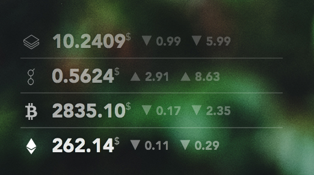

# Cryptocurrency ticker

A cryptocurrency ticker that outputs HTML to use with [GeekTool](https://www.tynsoe.org/v2/geektool/) on macOS.



## Usage

```bash
$ brew install jq
$ chmod +x cryptocurrency-ticker
$ ./cryptocurrency-ticker
```
